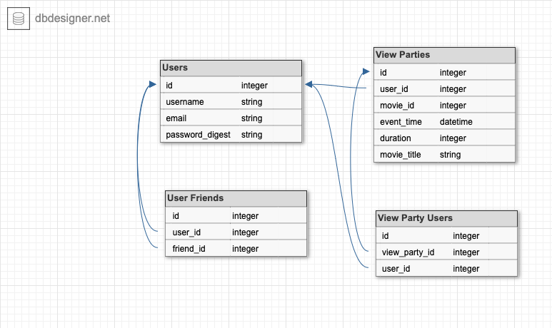

# Viewing Party 

[Noah Zinter](https://github.com/NoahZinter) [Zach Green](https://github.com/zachjamesgreen)

___

Viewing Party deployed on

- [Heroku](https://viewingpartyzjg.herokuapp.com/)
- AWS
- Google Cloud
- Linux Server

After registering, this application allows a user to find a movie to watch with friends. The movie data is from [The Movie Database](https://www.themoviedb.org/). Once a user finds that movie they can create a viewing party which they can invite their friends to.

This application uses:

- Rails
- PostgreSQL
- TailwindCSS
- TravisCI
- Heroku
- [TMDB API](https://developers.themoviedb.org/3/getting-started/introduction)
- Figaro

___

If you would like install this app locally you'll need to do a few things:

- Clone the code to your local machine `git clone git@github.com:zachjamesgreen/viewing_party.git `
- `bundle install`
- `rails db:{create,migrate}`
- `bundle exec rails webpacker:install`
- `yarn install`
- Get API key from [The Movie Database](https://developers.themoviedb.org/3/getting-started/introduction)
- `bundle exec figaro install` and add you API key to the config/application.yml file (api_key: <key>)

Once you have done all that run `bundle exec rspec to make sure all tests are passing` and you're on your way.

___

*Database schema*

Â

Our friends table uses a self referential relationship to better organize our data. 

